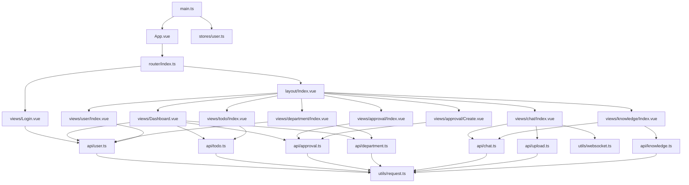

# aiworkhelper-web 前端项目总图

## 1. 项目定位

该项目是 AIOA 的 Web 前端，基于 Vue 3 + TypeScript 构建，承担以下职责：

- 登录认证与页面导航
- 工作台信息聚合展示
- 待办、审批、部门、用户等 OA 页面交互
- AI 对话、群聊/私聊、文件上传
- 知识库上传、检索问答、文档来源回看

技术栈摘要：

- 框架: `Vue 3`
- 语言: `TypeScript`
- 构建: `Vite`
- UI: `Element Plus`
- 路由: `Vue Router`
- 状态: `Pinia`
- 请求: `Axios`
- 实时通信: 原生 `WebSocket`

## 2. 目录分层

```text
src/
├── main.ts                 # 应用入口
├── App.vue                 # 根组件
├── router/                 # 路由与守卫
├── layout/                 # 主布局
├── stores/                 # 全局状态（当前主要是 user）
├── api/                    # 按业务域封装接口
├── utils/                  # request / websocket 等基础设施
├── types/                  # 类型定义
└── views/                  # 各业务页面
```

当前前端是典型的“页面驱动型”结构：

- `views/*` 承载大部分交互逻辑
- `api/*` 将后端接口按业务拆分
- `utils/request.ts` 统一处理鉴权和错误
- `stores/user.ts` 维护登录态

## 3. 启动链路

关键入口：`src/main.ts`

启动顺序：

1. `createApp(App)` 创建应用
2. 注册 `Pinia`
3. 注册 `router`
4. 调用 `useUserStore().initUserInfo()` 从 `localStorage` 恢复用户信息
5. `app.mount('#app')`

路由关键点：`src/router/index.ts`

- `/login` 为匿名页面
- `/` 下挂主布局 `layout/Index.vue`
- 主布局下再挂工作台、待办、审批、部门、用户、聊天、知识库页面
- `beforeEach` 负责登录态守卫

## 4. 总体路图



## 5. 核心业务链路

### 5.1 登录鉴权链路

关键文件：

- `src/views/Login.vue`
- `src/stores/user.ts`
- `src/router/index.ts`
- `src/utils/request.ts`

调用路径：

`Login.vue -> user store -> api/user.ts -> request.ts -> backend /v1/...`

说明：

- 登录成功后把 `token` 与 `userInfo` 写入 `localStorage`
- 路由守卫在进入受保护页面前检查 `userStore.token`
- 请求拦截器自动带上 `Authorization: Bearer <token>`
- 遇到 `401` 时前端自动登出并跳转登录页

### 5.2 主布局与导航链路

关键文件：`src/layout/Index.vue`

说明：

- 侧边菜单根据路由定义自动生成
- 顶栏读取 `userStore.userInfo`
- 提供全局退出登录和修改密码入口
- 业务页面统一挂载在布局内容区

### 5.3 工作台聚合链路

关键文件：`src/views/Dashboard.vue`

调用路径：

`Dashboard -> todo API + approval API + user API + department API`

说明：

- 工作台是一个聚合页面
- 同时拉取待办、审批、用户、部门相关数据
- 作为快速入口串联整个 OA 系统

### 5.4 待办链路

关键文件：

- `src/views/todo/Index.vue`
- `src/api/todo.ts`

调用路径：

`Todo page -> todo API -> backend /v1/todo*`

说明：

- 支持列表、创建、编辑、删除、完成
- 选择执行人时会联动用户接口
- 页面内会展示待办的执行记录与状态变化

### 5.5 审批链路

关键文件：

- `src/views/approval/Index.vue`
- `src/views/approval/Create.vue`
- `src/api/approval.ts`

调用路径：

`Approval list/create -> approval API -> backend /v1/approval*`

说明：

- 审批分为列表页与发起页
- 支持请假、补卡、外出等表单
- 页面会展示审批流状态和节点处理结果

### 5.6 部门与用户链路

关键文件：

- `src/views/department/Index.vue`
- `src/views/user/Index.vue`
- `src/api/department.ts`
- `src/api/user.ts`

调用路径：

`Department/User page -> department API / user API -> backend`

说明：

- 部门页维护树形结构与成员关系
- 用户页维护基础人员信息
- 这两类数据为待办、审批、聊天等模块提供底座

### 5.7 聊天与 AI 链路

关键文件：

- `src/views/chat/Index.vue`
- `src/api/chat.ts`
- `src/api/upload.ts`
- `src/utils/websocket.ts`

调用路径：

- AI: `Chat view -> createAIConversation/chatStream -> SSE`
- 实时聊天: `Chat view -> getWebSocket(token) -> ws backend`

说明：

- 聊天页同时承载 AI 对话、群聊、私聊三类能力
- AI 对话通过 SSE 流式展示回复和工具调用过程
- 群聊/私聊通过 WebSocket 保持实时连接
- 图片发送依赖上传接口

### 5.8 知识库链路

关键文件：

- `src/views/knowledge/Index.vue`
- `src/api/knowledge.ts`
- `src/api/chat.ts`

调用路径：

`Knowledge view -> upload/list/content API + AI conversation API`

说明：

- 先上传文档并查看文档列表
- 再通过 AI 会话结合知识库完成问答
- 页面支持查看回答来源并回看原文档内容

## 6. 页面与接口映射

| 页面 | 主要接口层 | 主要职责 |
| --- | --- | --- |
| `views/Login.vue` | `api/user.ts` | 登录、恢复用户态 |
| `views/Dashboard.vue` | `api/todo.ts` `api/approval.ts` `api/user.ts` `api/department.ts` | 聚合统计与快捷入口 |
| `views/todo/Index.vue` | `api/todo.ts` | 待办 CRUD 与完成 |
| `views/approval/Index.vue` | `api/approval.ts` | 审批列表、处理 |
| `views/approval/Create.vue` | `api/approval.ts` | 发起审批 |
| `views/department/Index.vue` | `api/department.ts` `api/user.ts` | 部门树与成员维护 |
| `views/user/Index.vue` | `api/user.ts` | 用户管理 |
| `views/chat/Index.vue` | `api/chat.ts` `api/upload.ts` `utils/websocket.ts` | AI 对话、群聊、私聊 |
| `views/knowledge/Index.vue` | `api/knowledge.ts` `api/chat.ts` | 知识库文档管理与问答 |

## 7. 关键文件清单

应用骨架：

- `.claude/aiworkhelper-web/src/main.ts`
- `.claude/aiworkhelper-web/src/App.vue`
- `.claude/aiworkhelper-web/src/router/index.ts`
- `.claude/aiworkhelper-web/src/layout/Index.vue`
- `.claude/aiworkhelper-web/src/stores/user.ts`

基础设施：

- `.claude/aiworkhelper-web/src/utils/request.ts`
- `.claude/aiworkhelper-web/src/utils/websocket.ts`
- `.claude/aiworkhelper-web/src/types/index.ts`

接口层：

- `.claude/aiworkhelper-web/src/api/user.ts`
- `.claude/aiworkhelper-web/src/api/todo.ts`
- `.claude/aiworkhelper-web/src/api/approval.ts`
- `.claude/aiworkhelper-web/src/api/department.ts`
- `.claude/aiworkhelper-web/src/api/chat.ts`
- `.claude/aiworkhelper-web/src/api/knowledge.ts`
- `.claude/aiworkhelper-web/src/api/upload.ts`

页面层：

- `.claude/aiworkhelper-web/src/views/Login.vue`
- `.claude/aiworkhelper-web/src/views/Dashboard.vue`
- `.claude/aiworkhelper-web/src/views/todo/Index.vue`
- `.claude/aiworkhelper-web/src/views/approval/Index.vue`
- `.claude/aiworkhelper-web/src/views/approval/Create.vue`
- `.claude/aiworkhelper-web/src/views/department/Index.vue`
- `.claude/aiworkhelper-web/src/views/user/Index.vue`
- `.claude/aiworkhelper-web/src/views/chat/Index.vue`
- `.claude/aiworkhelper-web/src/views/knowledge/Index.vue`

## 8. 阅读顺序建议

如果你要快速理解这个前端，建议按下面顺序看：

1. `src/main.ts`
2. `src/router/index.ts`
3. `src/stores/user.ts`
4. `src/utils/request.ts`
5. `src/layout/Index.vue`
6. 一个普通业务页：`src/views/todo/Index.vue`
7. 一个复杂业务页：`src/views/chat/Index.vue`
8. 知识库页：`src/views/knowledge/Index.vue`

## 9. 备注

当前前端存在少量历史不一致痕迹，但不影响本路图作为“当前实现总览”使用，例如：

- 某些 `types` 注释与页面实际使用的审批类型值不完全一致
- README 中部分 WebSocket 端口说明与现配置有差异

因此本路图以代码真实结构为准，而不是以历史说明文档为准。
