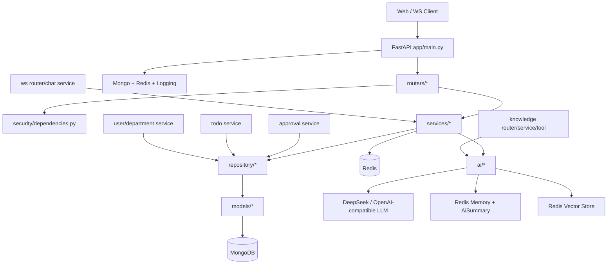

# AIOA 后端项目总图

## 1. 项目定位

该项目是一个基于 FastAPI 的智能办公后端，核心能力覆盖：

- 用户认证与权限校验
- 待办事项管理
- 审批流管理
- 部门与用户组织关系管理
- WebSocket 实时聊天
- AI 对话与会话记忆
- 知识库上传、向量化与检索问答

技术栈摘要：

- Web: `FastAPI` + `Uvicorn`
- 数据: `MongoDB` + `Beanie` + `Motor`
- 缓存/向量检索: `Redis`
- 鉴权: `JWT` + `passlib`
- AI: `LangChain` + OpenAI 兼容接口 + Embedding

## 2. 目录分层

```text
app/
├── main.py                 # 应用入口与生命周期
├── config/                 # 配置、异常、统一响应、Redis 引用
├── security/               # JWT、密码、当前用户依赖
├── routers/                # HTTP / WebSocket 接口层
├── services/               # 业务编排层
├── repository/             # 数据访问层
├── models/                 # Beanie Document / 枚举
├── dto/                    # 请求响应 DTO
└── ai/                     # Agent、LLM、Memory、Tools、Embedding、VectorStore
```

核心分层关系：

- `routers` 负责入参和协议边界
- `services` 负责业务流程编排
- `repository` 负责 Mongo 查询与持久化
- `models` 负责文档结构定义
- `ai` 负责 AI 相关能力的独立子系统

## 3. 启动链路

关键入口：`app/main.py`

启动顺序：

1. `create_app()` 创建 FastAPI 实例
2. 注册 CORS、中间件、全局异常处理器
3. 在 `lifespan()` 中初始化 MongoDB / Beanie
4. 初始化 Redis，并通过 `set_redis_client()` 暴露给知识库与 AI 工具
5. 启动 `ws_manager` 心跳检测
6. 注册业务路由到 `settings.API_PREFIX`，当前前缀为 `/v1`

对应文件：

- `app/main.py`
- `app/config/settings.py`
- `app/config/exceptions.py`
- `app/config/redis.py`

## 4. 总体路图



## 5. 核心业务链路

### 5.1 认证链路

入口文件：`app/routers/auth.py`

调用路径：

`auth router -> auth_service -> user_repository -> password/jwt -> ApiResponse`

说明：

- 登录/注册通过 HTTP 进入 `auth` 路由
- `auth_service` 完成用户校验、密码校验、Token 签发
- 受保护接口通过 `get_current_user` 解析 JWT 并回查用户状态

### 5.2 待办链路

入口文件：

- `app/routers/todo.py`
- `app/services/todo_service.py`

调用路径：

`todo router -> todo_service -> todo_repository -> Todo`

说明：

- 创建待办时生成执行人列表
- 完成待办时按当前用户更新自己的执行状态
- 全部执行人完成后汇总更新主状态

### 5.3 审批链路

入口文件：

- `app/routers/approval.py`
- `app/services/approval_service.py`

调用路径：

`approval router -> approval_service -> approval_repository + department_repository + department_user_repository`

说明：

- 审批单创建时依据部门层级和负责人关系构造审批链
- 流转通过 `approvalIdx` 与当前审批人推进
- 业务上与部门组织树紧密耦合

### 5.4 组织与用户链路

入口文件：

- `app/routers/user.py`
- `app/routers/department.py`

调用路径：

`user/department router -> service -> repository -> User / Department / DepartmentUser`

说明：

- `Department` 使用 `parentId` / `parentPath` 表达树结构
- `DepartmentUser` 维护用户与部门的挂载关系
- 审批、群聊、待办执行人选择都依赖这层基础数据

### 5.5 WebSocket 聊天链路

入口文件：

- `app/routers/ws.py`
- `app/services/ws_manager.py`
- `app/services/chat_service.py`

调用路径：

`/v1/ws/chat -> authenticate_websocket -> ws_manager.connect -> _handle_chat -> chat_service -> chat_log_repository / unread_service`

说明：

- 连接时支持从 Header 或 Query 中取 Token
- 支持群聊和私聊消息
- 消息持久化到 `ChatLog`
- 未读统计由 `UnreadMessage` 和 `unread_service` 维护

### 5.6 AI 对话链路

入口文件：

- `app/routers/ai.py`
- `app/services/ai_chat_service.py`
- `app/services/ai_conversation_service.py`

调用路径：

`/v1/ai/chat/stream -> ai_chat_service -> memory_manager -> tool registry -> agent -> llm`

说明：

- AI 会话先存储为 `AiConversation`
- 对话消息写入 `ChatLog`
- SSE 事件类型包括 `ai_chunk`、`ai_tool_call`、`ai_tool_result`、`ai_complete`
- Memory 结合 Redis 和摘要表 `AiSummary`

### 5.7 知识库链路

入口文件：

- `app/routers/knowledge.py`
- `app/repository/knowledge_repository.py`
- `app/ai/tools/knowledge_tool.py`

调用路径：

`knowledge upload -> KnowledgeDocument -> parser/chunker -> embedding -> Redis vector store -> AI retrieval`

说明：

- 文件上传后先保存文档元数据和原始文件
- 文档解析、切块、向量化依赖 AI 工具链
- 检索走 Redis 向量索引，结果再喂给 Agent 生成答案

## 6. 关键文件清单

基础入口：

- `app/main.py`
- `app/config/settings.py`
- `app/config/exceptions.py`
- `app/config/redis.py`

路由层：

- `app/routers/auth.py`
- `app/routers/user.py`
- `app/routers/todo.py`
- `app/routers/approval.py`
- `app/routers/department.py`
- `app/routers/ws.py`
- `app/routers/ai.py`
- `app/routers/knowledge.py`

服务层：

- `app/services/auth_service.py`
- `app/services/user_service.py`
- `app/services/todo_service.py`
- `app/services/approval_service.py`
- `app/services/department_service.py`
- `app/services/chat_service.py`
- `app/services/unread_service.py`
- `app/services/ws_manager.py`
- `app/services/ai_chat_service.py`
- `app/services/ai_conversation_service.py`

AI 子系统：

- `app/ai/agent.py`
- `app/ai/llm.py`
- `app/ai/embedding.py`
- `app/ai/memory/memory_manager.py`
- `app/ai/tools/registry.py`
- `app/ai/tools/knowledge_tool.py`
- `app/ai/vectorstore/redis_store.py`

测试：

- `tests/api/test_auth.py`
- `tests/api/test_todo.py`
- `tests/api/test_approval.py`
- `tests/api/test_department.py`
- `tests/api/test_ws.py`
- `tests/api/test_ai_conversation.py`
- `tests/unit/test_ai_agent.py`
- `tests/unit/test_ai_chat_sse.py`
- `tests/unit/test_ai_memory.py`

## 7. 阅读顺序建议

如果你要快速理解这个后端，建议按下面顺序看：

1. `app/main.py`
2. `app/config/settings.py`
3. 一个普通 CRUD 链路：`routers/todo.py -> services/todo_service.py -> repository/todo_repository.py -> models/todo.py`
4. 一个复杂业务链路：`routers/approval.py -> services/approval_service.py`
5. 一个实时链路：`routers/ws.py -> services/ws_manager.py -> services/chat_service.py`
6. 一个 AI 链路：`routers/ai.py -> services/ai_chat_service.py -> ai/*`
7. 一个知识库链路：`routers/knowledge.py -> ai/tools/knowledge_tool.py`

## 8. 备注

当前代码与部分历史文档/测试存在细节不一致的迹象，例如：

- API 前缀有 `/v1` 与 `/api/v1` 的历史差异
- WebSocket 心跳策略的文档与实现不完全一致

这不影响本路图作为“当前代码结构总览”使用。
